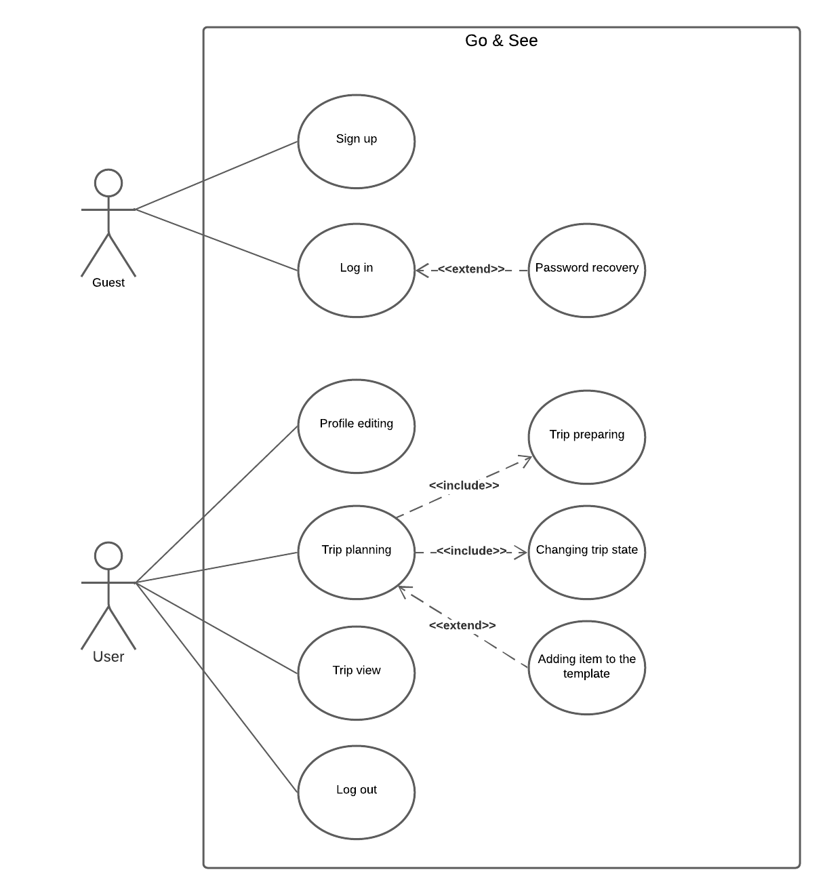
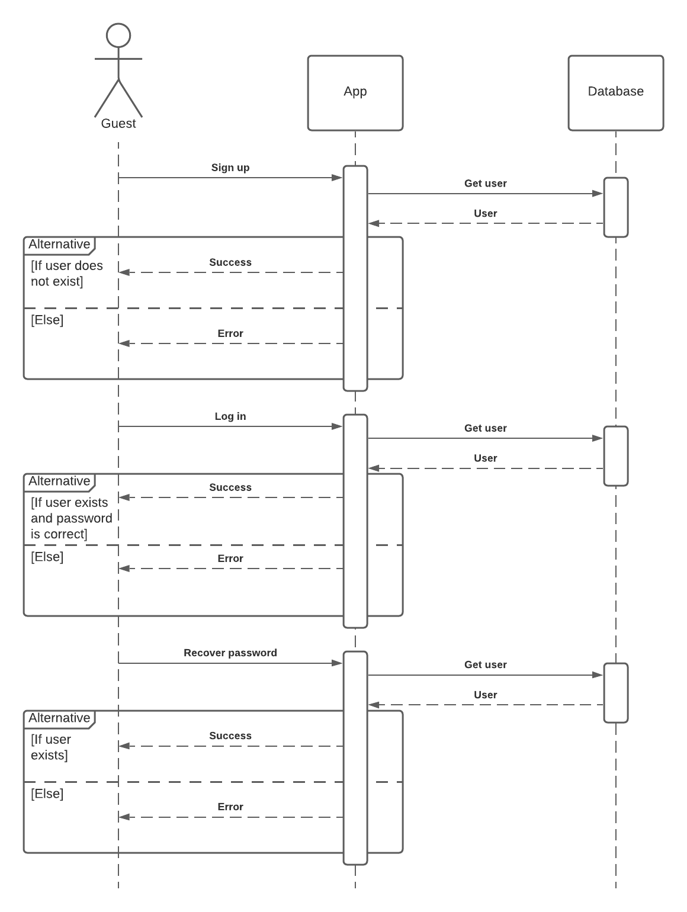
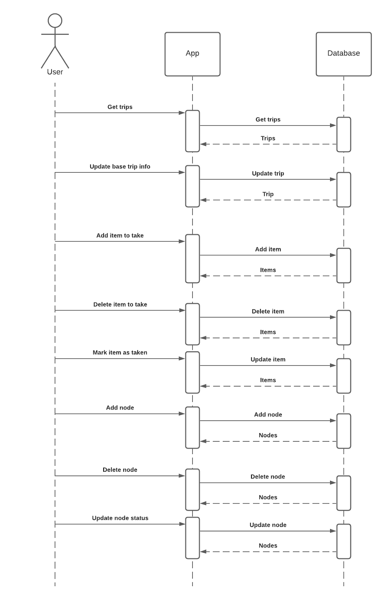
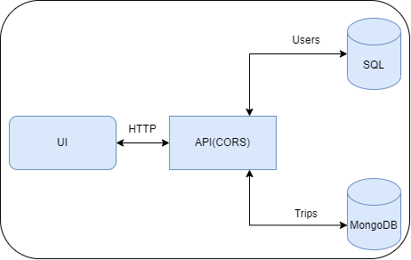
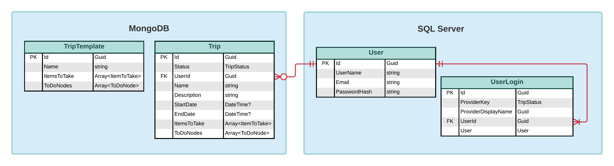

# **TeamGroup**

## **Table of Contents**

- [Team](#team)
- [Description](#project-description)
- [Architecture](#architecture)
- [Data Model](#data-model)
- [Resiliency model](#resiliency-model)
- [Security model](#security-model)
- [Deployment model](#deployment-model)
- [Analics model](#analics-model)
- [Monitoring](#monitoring)


## **Team**

- Chakalov Oleksandr
- Shevyak Ivan
- Dmytro Hnatyshyn
- Anton Vyhovanets

## **Project Description**

### **Go & See**

This web application is a trip planner which can make organizing your trips easier than it was before. With the assistance of our service user has no need to write down long lists of different items before his journey. All these items will be in one place - our planner, and the only thing that traveler should do before his vacation is to check if he doesn’t forget anything from the list that suggests the Go & See service.

**Use case diagram**




<br/>
<br/>

**Guest sequence diagram**




<br/>
<br/>

**User sequence diagram**




<br/>
<br/>

## **Architecture**

| Part of project | Description                                               | Technologies                  |
| --------------- | --------------------------------------------------------- | ----------------------------- |
| Back end        | API based on CQRS                                         | .NET 5, ASP.Net Core          |
| Fron end        | SPA                                                       | React, Type Script, AntDesign |
| DB              | SQL database for user management and NoSQL for user trips | Azure SQL Database, MongoDB   |

<br/>



<br/>
<br/>

Example of _Trip_ document for MongoDB:

```json
{
  "id": "00000000-0000-0000-0000-000000000000",
  "status": 1,
  "userId": "00000000-0000-0000-0000-000000000000",
  "name": "string",
  "description": "string",
  "startDate": "2021-10-23T17:36:04.432Z",
  "endDate": "2021-10-23T17:36:04.432Z",
  "itemsToTake": [
    {
      "id": "00000000-0000-0000-0000-000000000000",
      "name": "string",
      "isTaken": true
    }
  ],
  "toDoNodes": [
    {
      "id": "00000000-0000-0000-0000-000000000000",
      "name": "string",
      "description": "string",
      "type": 1,
      "date": "2021-10-23T17:36:04.432Z",
      "status": 1
    }
  ]
}
```

Example of _TripTemplate_ document for MongoDB:

```json
{
  "id": "00000000-0000-0000-0000-000000000000",
  "name": "string",
  "itemsToTake": [
    {
      "id": "00000000-0000-0000-0000-000000000000",
      "name": "string",
      "isTaken": true
    }
  ],
  "toDoNodes": [
    {
      "id": "00000000-0000-0000-0000-000000000000",
      "name": "string",
      "description": "string",
      "type": 1,
      "date": "2021-10-23T17:36:04.432Z",
      "status": 1
    }
  ]
}
```

# Data model
* User data is stored permanently. Data can be deleted by the user when he decides to do it.
* User login data is stored permanently. The data can be used for further analysis.
* Trip templates are saved permanently. The administrator can add new trip templates that are gaining popularity, or delete templates that lose relevance.
* The user's trips are stored in the database as long as the user exists, or until the user himself deletes the trip data.

## Tables for storing user data
### User
|     |     |
| --- | --- |
| Id | user identifier |
| UserName | user's name |
| Email | user's email |
| PasswordHash | hash code of the user's password |

### UserLogin
| --- | --- |
| Id | user login Id |
| ProviderKey | provider key |
| ProviderDisplayName | provider name |
| UserId | user identifier |
| User | user data |


## Tables for storing templates of trips
### TripTemplate
| --- | --- |
| Id |  trip template identifier |
| Name |  name of trip |
| ItemsToTake |  list of items you should take to that kind of trip {ItemToTake} |
| ToDoNodes |  list of things you should do on that kind of trip {ToDoNodes} |

### ItemToTake
| --- | --- |
| Name | item name |
| IsTaken | flag of taken item |

### ToDoNode
| --- | --- |
| Name | item name |
| Description | Description of node | 
| Type | current type // Before Trip/At Trip/After Trip |
| Date | time when you did it |
| Status | current status To // Do/In Progress/Done |


## Table for storing trips
### Trip
| --- | --- |
| Id | trip identifier |
| Status | trip status // enum Planned/In Progress/Closed |
| UserId | user identifier |
| Name | name of trip |
| Description | Description of trip |
| StartDate | date when trip start |
| EndDate  | date when trip end |
| ItemsToTake | list of items you should take to that kind of trip |
| ToDoNodes | list of things you should do on that kind of trip |


# Resiliency model
The system is small, so there is not much place for error.
1. When using app, there may be a malfunction of the API, it is not available. In this case, app will notify user that service is currently unavailable.
2. When using app, one of the databases may malfunction, it is not possible to use information about users or about their trips, so it will be possible to view only information stored locally.

## ER Diagram



# Security model
1. HTTP protocol is used cominicatig with API, so secure info can be stollen by adversary.
2. Secure user info can be stollen by sniffing traffic on log in, sign up or password recovery stages.
3. UI can be changed on the fly by JS injection attack and secure info user may be stollen. 
4. Access to the API may be blocked by denial of service attack.
5. Access to the SQL database may be blocked by denial of service attack.
6. Access to the MongoDB service can be blocked by denial of service attack.
7. Access to the web UI may be blocked through denial to service attack.
8. Access to SQL database with user info can be obtained by sniffing trafic.
9. Access to the unencypted MongoDB data can be obtained by elevating user privileges.
10. Access to the databases (SQL or MongoDB) can be obtained due to lack of the network protection.
11. An adversary can spam through browser automation with account creation.


# Deployment model


# Analics model
| Metrics | Way to collect | Value | Mitigation plan |
| ------- | -------------- | ------| --------------- |
| Quantity of active users | Server side script | num | Advertisement |
| Interaction with login page | Pixel or Google Analitics on the UI side | - | UI changes , A/B testing |
| Number of discarded trips per user | Server side script | num | - |
| Time spent on trip creation | Frontend script | seconds | Updating UX to reduce time |
| Time spent with sign up procedure | Frontend script | seconds | Updating UX to reduce time |

# Monitoring
| Metrics | Way to collect | Value | Mitigation plan |
| ------- | -------------- | ------| --------------- |
| Memory used | GCP monitoring | Mb | Add more memory |
| CPU used | GCP monitoring | percentage | Increace CPU core number |
| Failed db requests | Specific scripts | numer | Investigate possible causes |
| Request processing time | - | miliseconds | Optimize performance |


